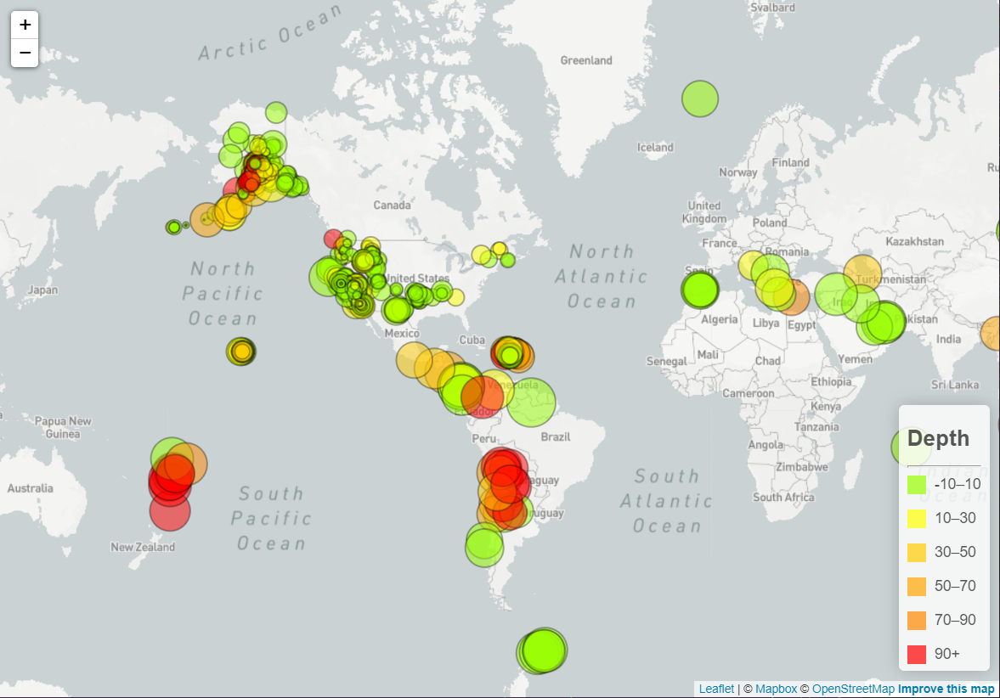

# Visualizing Data with Leaflet

## Background

This project utilizes Leaflet, Javascript, html, and mapbox api to visualize earthquake data from the Untited States Geological Survey (USGS).  The USGS is responsible for providing scientific data about natural hazards, the health of our ecosystems and environment; and the impacts of climate and land-use change. Their scientists develop new methods and tools to supply timely, relevant, and useful information about the Earth and its processes.  The goal is to display the earthquake data in a meaningful way that will better educate the public on issues facing our planet.

## Level 1 - Basic Visualization

### Import the Data

* The data was collected from the [USGS GeoJSON Feed](https://earthquake.usgs.gov/earthquakes/feed/v1.0/summary/all_week.geojson) for earthquakes that occurred in the past 7 days.

* Using leaflet and geoJSON, the data was able to be extracted for use in our map visualization.

### Visualize the Data

* Leaflet was used to plot all of the earthquakes in the data set based on their latitude and longitude.

* The magnitude of each earthquake is reflected in the size of the marker. 
  - Earthquakes with higher magnitudes appear larger.

* The color of the marker is determined by the depth of the earthquake.
  - Earthquakes of greater depth appear darker in color.

* A popup that provides additional information about each earthquake appears when a marker is clicked.

